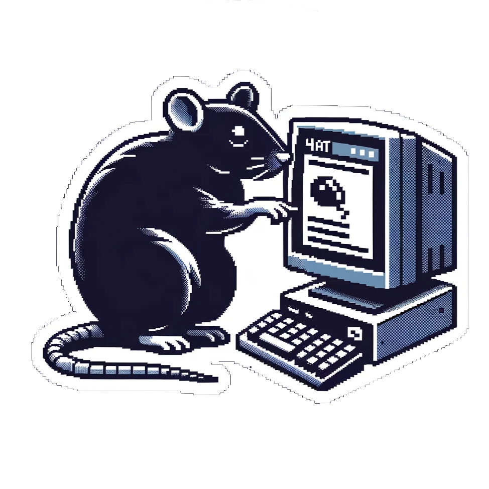

<h1 align="center">🐀 rat-at-4at</h1>



> A simple TUI using the [ratatui](https://github.com/ratatui-org/ratatui) crate to serve as a front-end to [4at](https://github.com/tsoding/4at)

rat-at-4at is a personal exploration into the world of TUIs, specifically focusing on the [ratatui](https://github.com/ratatui-org/ratatui) crate. This project is born out of a curiosity to experiment with ratatui, which has been on my radar for some time. While [Tsoding](https://www.twitch.tv/tsoding) is developing a client front-end using crossterm directly in the official 4at repo, this repository serves as a separate playground for my experiments with ratatui. I encourage everyone to check out the original code and Tsoding's streams for a deeper understanding of 4at. If you're interested in contributing to this repository, feel free to file an issue or contact me at [danielboll.dev@proton.me](mailto:danielboll.dev@proton.me) for collaboration opportunities.

## 🌟 Quick Start Guide

**Get started with rat-at-4at in a snap!**

1. **Launch the Client:**

   Use Rust's Cargo to run the application in release mode:

   ```bash
   cargo run --release
   ```

2. **Authenticate:**

   Upon starting, the client will prompt you to enter your chat token. This is a necessary step to ensure secure and personalized access.

3. **Dive into Chat:**

   Once authenticated, you're all set to start chatting!

## 🛠 Installation

1. **Clone the Repository:**

   ```bash
   git clone https://github.com/daniel-boll/rat-at-4at.git
   ```

2. **Navigate to the Directory:**

   ```bash
   cd rat-at-4at
   ```

3. **Install Dependencies:**

   ```bash
   cargo install
   ```

4. **Run the Application:**

   Follow the Quick Start instructions above to launch rat-at-4at.

## 📃 License

Both [rat-at-4at](https://github.com/daniel-boll/rat-at-4at) and [4at](https://github.com/tsoding/4at) are released under the [MIT License](#). Feel free to use it, modify it, and distribute it as you see fit.
